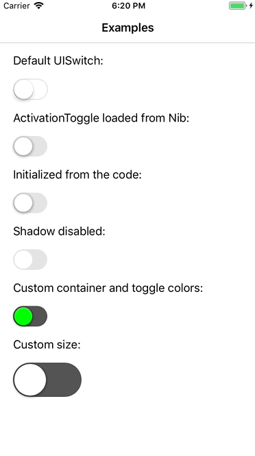

## ActivationToggle [](https://developer.apple.com/swift/) [](https://img.shields.io/cocoapods/v/ActivationToggle.svg)

<p align="center">

</p>

Toggle control that transforms to checkmark on activation.

## Installation
*ActivationToggle requires iOS 8.0 or later.*

### Using [CocoaPods](http://cocoapods.org)

1.  Add the pod `ActivationToggle` to your [Podfile](http://guides.cocoapods.org/using/the-podfile.html).

pod 'ActivationToggle'

2.  Run `pod install` from Terminal, then open your app's `.xcworkspace` file to launch Xcode.

## Basic Usage

Import the module.

```swift
import ActivationToggle
```

Just create a toggle and configure it

```swift
override func viewDidLoad() {
super.viewDidLoad()

let toggle = ActivationToggle()

toggle.onColor = UIColor.purple
toggle.offColor = UIColor.darkGray
toggle.toggleColor = UIColor.green

toggle(self, action: #selector(valueChanged(control:)), for: .valueChanged)

view.addSubview(toggle)
}
```

## Demo

Build and run the `ActivationToggle-Example` project in Xcode to see `ActivationToggle` in action.


## TODOs

- [] Add swipe gesture handling and animations

## Communication

- If you **found a bug**, open an issue.
- If you **have a feature request**, open an issue.
- If you **want to contribute**, submit a pull request.

## Contact

Nikita Belosludtcev

- https://github.com/nikitabelosludtcev
- https://nikitabelosludtcev.github.io/
- nbelosludtcev@gmail.com

## License

This project is available under the Apache License, version 2.0. See the LICENSE file for more info.
